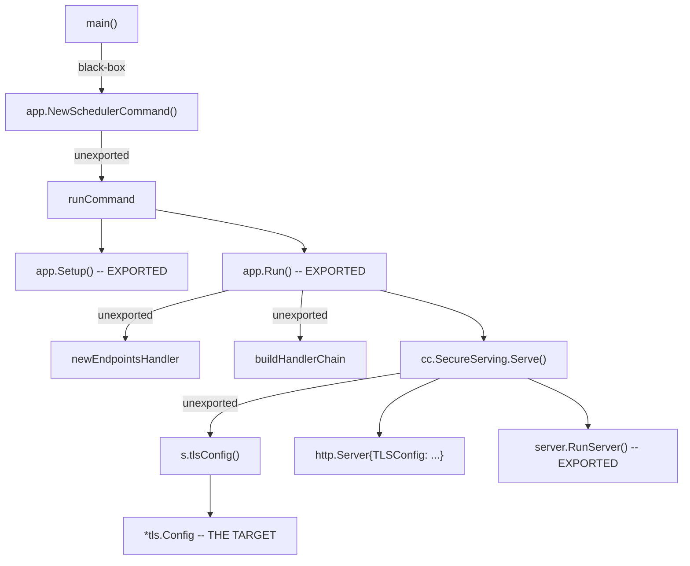
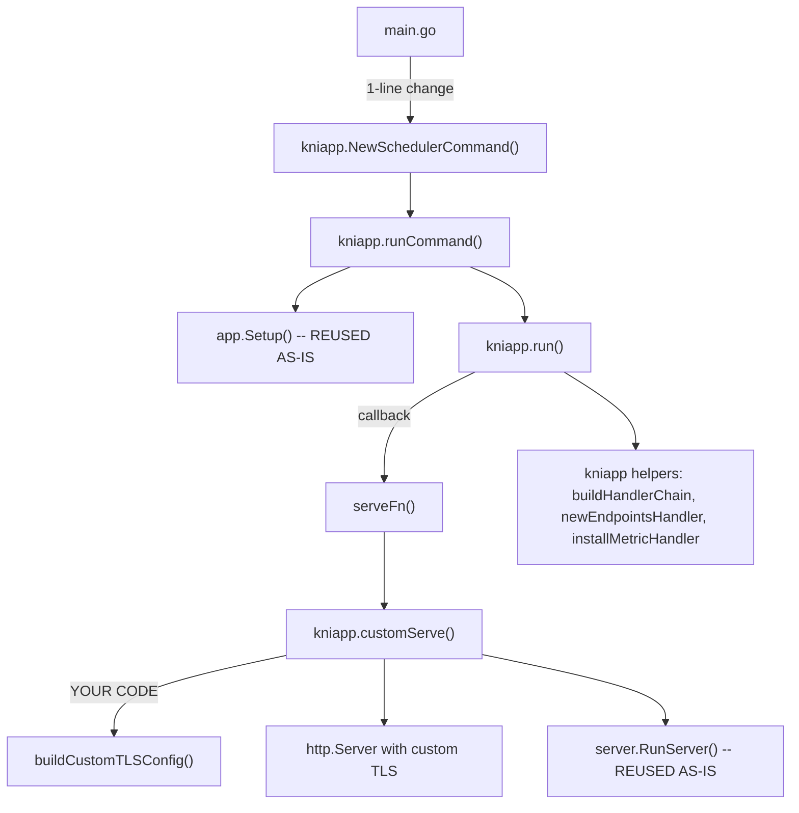

# Injecting a Custom TLS Config -- No Vendor Changes

## Why Code Must Be Copied

The TLS config is built inside a private method (`tlsConfig()`) called from `SecureServingInfo.Serve()`, which is called from `app.Run()`, which in turn uses two unexported helper functions to build the HTTP handler. There is no public hook, interface, or callback anywhere in this chain:




We cannot call `app.Run()` and get a different TLS config. We cannot set `cc.SecureServing = nil` and start the server separately because the handler is built inside `Run()` using closures over channels that `Run()` creates internally (health checks, leader status). The handler and server lifecycle are entangled inside `Run()`.

**What we can reuse untouched:** `app.Setup()` (config + scheduler construction), `server.RunServer()` (goroutine/shutdown lifecycle), all the exported types and health check constructors.

**What we must copy:** `app.Run()` (to replace the `Serve()` call), plus the 3 small unexported functions it calls to build the handler, plus `NewSchedulerCommand()` and `runCommand()` to get a hook point between `Setup()` and `Run()`.

---

## Design: Callback Injection via `serveFunc`

The core idea is to **not inline** custom TLS logic into the copied `Run()`. Instead, we make the copied `Run()` accept a callback that replaces the `cc.SecureServing.Serve()` call. This reduces the diff against upstream to exactly 2 lines per function, making rebase a mechanical diff operation.

```go
// The callback type -- defined in serve.go
type serveFunc func(
    serving *apiserver.SecureServingInfo,
    handler http.Handler,
    shutdownTimeout time.Duration,
    stopCh <-chan struct{},
) (<-chan struct{}, <-chan struct{}, error)
```

In the copied `run()`, the single changed call site becomes:

```go
// Upstream (in app.Run):
stoppedCh, listenerStoppedCh, err := cc.SecureServing.Serve(handler, shutdownTimeout, internalStopCh)

// Ours (in run):
stoppedCh, listenerStoppedCh, err := serveFn(cc.SecureServing, handler, shutdownTimeout, internalStopCh)
```

All custom TLS logic lives entirely inside the `serveFunc` implementation -- zero custom code is woven into copied upstream code.

---

## The Plan

### Package: `pkg-kni/app`

All copied and new code lives in a single new package: `pkg-kni/app`. This mirrors the upstream `app` package name it is derived from, follows the existing `pkg-kni/` convention (`knidebug`, `features`), and is imported as `kniapp` in `main.go` to avoid collision with the vendored `app`.

### Architecture




### File layout

```
pkg-kni/app/
  sched_helpers.go   -- verbatim copy, 0 diff vs upstream
  sched_run.go       -- copy of Run(), 2-line diff (signature + call site)
  sched_command.go   -- copy of NewSchedulerCommand() + runCommand(), 2-line diff
  serve.go           -- all new code: serveFunc type, customServe(), buildCustomTLSConfig()

cmd/noderesourcetopology-plugin/
  main.go            -- 1-line change: kniapp.NewSchedulerCommand() instead of app.NewSchedulerCommand()
```

---

## Per-File Detail

### `pkg-kni/app/sched_helpers.go` -- VERBATIM COPY

Source: [vendor/k8s.io/kubernetes/cmd/kube-scheduler/app/server.go](vendor/k8s.io/kubernetes/cmd/kube-scheduler/app/server.go) lines 342-399.

Contains three unexported helpers copied byte-for-byte (just adjusting the package declaration):

- `buildHandlerChain()` (lines 342-354, 13 lines)
- `installMetricHandler()` (lines 356-367, 12 lines)
- `newEndpointsHandler()` (lines 372-399, 28 lines)

All three reference only exported symbols from vendored packages; they compile in any package with the correct imports.

**Diff vs upstream: 0 lines.** On rebase, overwrite with the new upstream version if it changed.

### `pkg-kni/app/sched_run.go` -- 2-LINE DIFF

Source: [vendor/k8s.io/kubernetes/cmd/kube-scheduler/app/server.go](vendor/k8s.io/kubernetes/cmd/kube-scheduler/app/server.go) lines 171-339.

Copy of `app.Run()` renamed to `run()` (unexported within the package). Exactly two lines differ:

```diff
-func Run(ctx context.Context, cc *schedulerserverconfig.CompletedConfig, sched *scheduler.Scheduler) error {
+func run(ctx context.Context, cc *schedulerserverconfig.CompletedConfig, sched *scheduler.Scheduler, serveFn serveFunc) error {
     ...
-       stoppedCh, listenerStoppedCh, err := cc.SecureServing.Serve(handler, shutdownTimeout, internalStopCh)
+       stoppedCh, listenerStoppedCh, err := serveFn(cc.SecureServing, handler, shutdownTimeout, internalStopCh)
```

The other ~165 lines are identical to upstream.

**Diff vs upstream: 2 lines.** On rebase, diff against the new `app.Run()` -- expect exactly the 2 known diffs; merge anything else.

### `pkg-kni/app/sched_command.go` -- 2-LINE DIFF

Source: [vendor/k8s.io/kubernetes/cmd/kube-scheduler/app/server.go](vendor/k8s.io/kubernetes/cmd/kube-scheduler/app/server.go) lines 90-168.

Copies of `NewSchedulerCommand()` (exported, callable from main.go) and `runCommand()`. Two lines differ:

1. In `NewSchedulerCommand`, the `RunE` calls the local `runCommand()` instead of the upstream unexported one (structurally identical code, different package scope).
2. In `runCommand`, the final line calls `run(ctx, cc, sched, customServe)` instead of `app.Run(ctx, cc, sched)`.

**Diff vs upstream: 2 lines.** On rebase, diff against lines 90-168 -- expect exactly the 2 known diffs.

### `pkg-kni/app/serve.go` -- ALL NEW CODE

No upstream equivalent. Contains:

- `**serveFunc` type** -- the callback signature (5 lines)
- `**customServe()`** -- the `serveFunc` implementation that constructs an `http.Server` with a custom `*tls.Config` and calls the exported `server.RunServer()` (~30 lines, replaces `SecureServingInfo.Serve()`)
- `**buildCustomTLSConfig()`** -- your custom TLS config construction (placeholder until requirements are defined)

This is the only file where your custom logic lives. It never needs diffing against upstream.

---

## How TLS configuration is obtained from the OpenShift cluster

The proposal does not define *where* the TLS profile comes from; it only provides the hook (`buildCustomTLSConfig()`). There are two practical ways to obtain the cluster TLS configuration with this design.

### Option A: Scheduler reads the APIServer resource in-process

The scheduler binary runs inside the cluster and already has a Kubernetes rest config. So `buildCustomTLSConfig()` can:

1. **Build a client** that can read `config.openshift.io` (e.g. add `configv1.Install(scheme)` and use the same rest config as the scheduler).
2. **Fetch** `apiservers.config.openshift.io/cluster` (name `"cluster"`).
3. **Resolve** the effective `TLSProfileSpec` from `Spec.TLSSecurityProfile` (Old/Intermediate/Modern/Custom → MinTLSVersion + Ciphers; later CurvePreferences when the API has them).
4. **Convert** that spec to `*tls.Config` (MinVersion, CipherSuites, CurvePreferences) using the same mapping logic as NRO's `internal/tlsprofile` or [controller-runtime-common/pkg/tls](https://github.com/openshift/controller-runtime-common/tree/main/pkg/tls).

**Requirements:** scheduler-plugins would depend on `openshift/api` and a client for `config.openshift.io`. RBAC for the scheduler's service account: `get` (and optionally `list`/`watch`) on `apiservers.config.openshift.io`.

**Pros:** Single source of truth; scheduler always uses current cluster profile.  
**Cons:** scheduler-plugins gains OpenShift-specific dependencies; on non-OpenShift, `buildCustomTLSConfig()` must fall back (e.g. nil → Go defaults, or a safe default profile).

### Option B: NRO (deployer) obtains the profile and injects it

NRO already has the TLS profile (it uses it for the operator webhook and metrics). NRO can:

1. **Fetch** the profile in the scheduler reconciler (`tlsprofile.FetchAPIServerTLSProfile(ctx, r.Client)`).
2. **Inject** the profile into the scheduler pod so the binary can read it without calling the API:
   - **ConfigMap:** NRO creates/updates a ConfigMap (e.g. `scheduler-tls-profile`) with `minTLSVersion` and `cipherSuites` (comma-separated). The scheduler Deployment mounts it. `buildCustomTLSConfig()` reads the mounted file(s) and builds `*tls.Config`.
   - **Environment variables:** NRO sets env vars on the scheduler container (e.g. `TLS_MIN_VERSION=VersionTLS12`, `TLS_CIPHER_SUITES=...`). `buildCustomTLSConfig()` uses `os.Getenv()` and builds `*tls.Config`.
   - **Command-line flags:** The scheduler binary defines flags (e.g. `--tls-min-version`, `--tls-cipher-suites`). NRO sets these in the Deployment container `args` from the resolved profile. At startup the scheduler parses flags; `buildCustomTLSConfig()` uses them when constructing the HTTPS server.

NRO watches `apiservers.config.openshift.io` and updates the ConfigMap / env / args when the cluster TLS profile changes, so the scheduler pod rolls with the new config.

**Requirements:** scheduler-plugins only needs code to *consume* the profile (parse file/env/flags → `*tls.Config`). No OpenShift API in scheduler-plugins. NRO extends the scheduler reconciler to inject the profile (see [TLS_SCHEDULER_DEPLOYMENT.md](./TLS_SCHEDULER_DEPLOYMENT.md)).

**Pros:** scheduler-plugins stays OpenShift-agnostic.  
**Cons:** Two-step (NRO fetches → injects; scheduler consumes). Profile updates when NRO reconciles and the pod rolls.

### Recommendation

- **Option A** if scheduler-plugins is OpenShift-only or already has config.openshift.io: TLS is "read cluster profile in-process" like the operator.
- **Option B** if scheduler-plugins must remain vanilla Kubernetes: TLS is "deployer injects, binary consumes," like RTE with NRO-injected flags.

### `cmd/noderesourcetopology-plugin/main.go` -- 1-LINE CHANGE

```diff
-   command := app.NewSchedulerCommand(
+   command := kniapp.NewSchedulerCommand(
        app.WithPlugin(noderesourcetopology.Name, noderesourcetopology.New),
        app.WithPlugin(knidebug.Name, knidebug.New),
    )
```

Plus the import `kniapp "sigs.k8s.io/scheduler-plugins/pkg-kni/app"`. Everything else unchanged.

---

## What is NOT touched

- **All vendor code** -- zero changes
- `**app.Setup()`** -- called as-is from `kniapp.runCommand()`, returns `CompletedConfig` + `Scheduler`
- `**server.RunServer()`** -- called as-is from `kniapp.customServe()`, handles goroutine lifecycle and graceful shutdown
- **All health checks, metrics, pprof, configz, statusz** -- in the verbatim-copied `newEndpointsHandler()`
- **Plugin registration** -- `noderesourcetopology.New` and `knidebug.New` passed to `app.Setup()` via `app.WithPlugin()` same as before
- **Leader election, informer sync, graceful shutdown** -- in the copied `run()`, identical to upstream

---

## Rebase Strategy

Each file with copied code has a header comment identifying the exact upstream source and line range. On rebase:


| File               | Action                                                    | Expected diffs                                           |
| ------------------ | --------------------------------------------------------- | -------------------------------------------------------- |
| `sched_helpers.go` | Diff against new `vendor/.../app/server.go` lines 342-399 | Zero. If any, overwrite with new upstream.               |
| `sched_run.go`     | Diff against new `vendor/.../app/server.go` lines 171-339 | Exactly 2 (signature + call site). Merge anything else.  |
| `sched_command.go` | Diff against new `vendor/.../app/server.go` lines 90-168  | Exactly 2 (RunE target + run call). Merge anything else. |
| `serve.go`         | No upstream equivalent                                    | Nothing to diff.                                         |
| `main.go`          | No copied code                                            | Nothing to diff.                                         |


Total expected diff vs upstream across all files: **4 lines** (plus package/import changes).

This could be automated with a Makefile target that extracts the relevant line ranges from the vendored `server.go` and diffs them against the local files, flagging any unexpected divergence.

---

## Summary

The `serveFunc` callback pattern isolates the TLS customization into a single file (`serve.go`) that has no upstream counterpart and never needs rebasing. The copied upstream code is split across 3 files with a total of 4 intentional line differences, all trivially identifiable during rebase. The only change to the existing project code is a 1-line import swap in `main.go`.